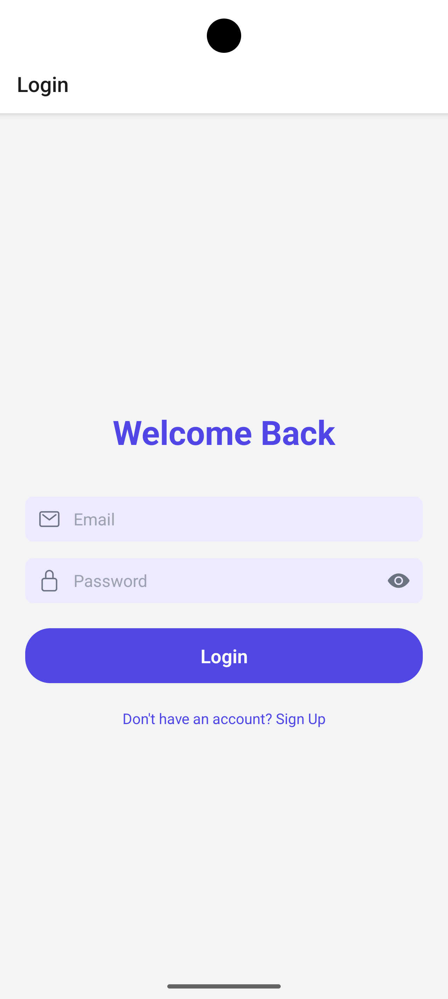
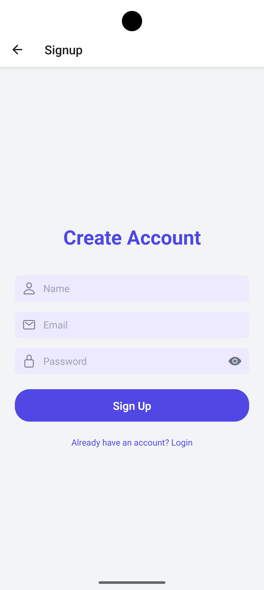
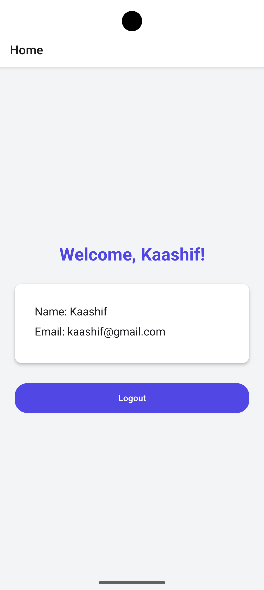
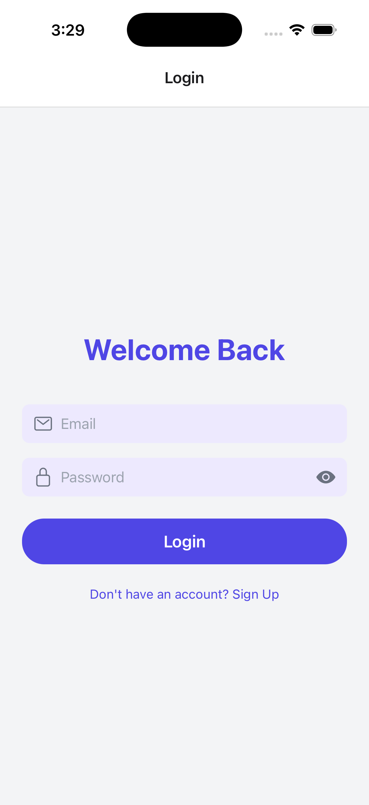
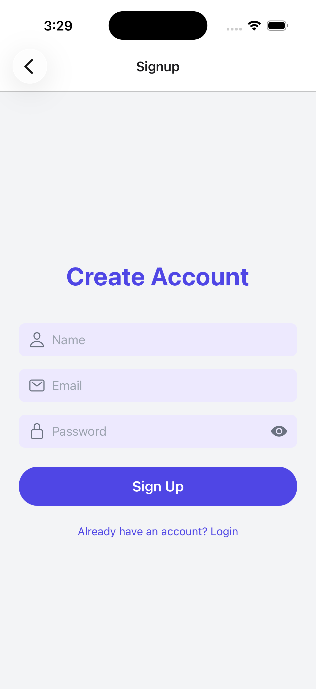
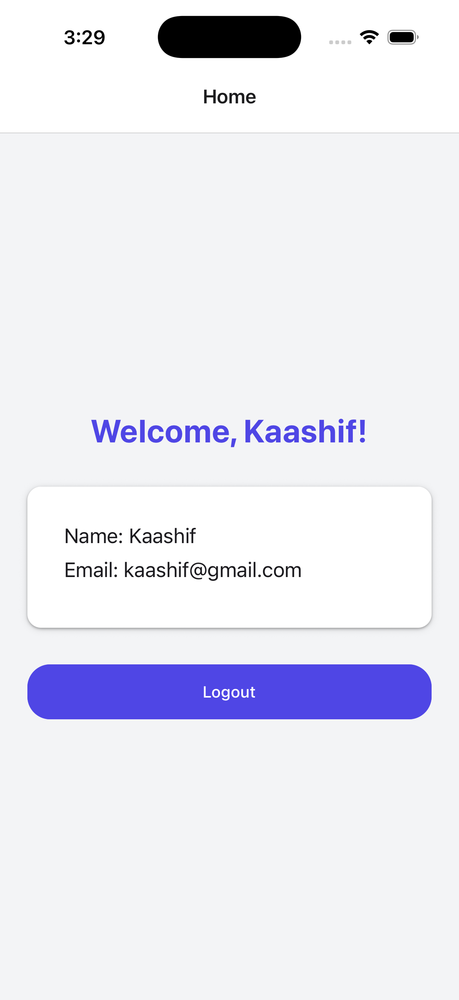

# React Native Authentication App

## Overview
This project demonstrates a simple authentication flow using React Native.

## Technologies Used
- React Native
- React Context API
- React Navigation
- AsyncStorage

## Features
- Login screen
- Signup screen
- Home screen
- Context API for authentication
- Form validation
- Password visibility toggle
- Persistent login using AsyncStorage

## Installation

Clone repository

git clone https://github.com/kaashif7/auth-app.git

Install dependencies

npm install
or
yarn install

Run on Android

Make sure you have Android Studio and an emulator or device connected.

Start Metro bundler:

npx react-native start

In another terminal, run:

npx react-native run-android

Run on iOS

Make sure you have Xcode installed and an iOS simulator or device.

Install CocoaPods dependencies:

cd ios

pod install

cd ..

Start Metro bundler:

npx react-native start

In another terminal, run:

npx react-native run-ios

⚠️ Note: iOS requires macOS and Xcode to build and run the app. Android works on Windows, macOS, and Linux.

## Screens

1. Login Screen – Email and password input, login button, and navigation to Signup.
2. Signup Screen – Name, email, password input, signup button, and navigation to Login.
3. Home Screen – Displays user info and logout button.

## Screenshots

Android Preview

iOS Preview

## Bonus Features

- Password visibility toggle
- Persistent login state

## Author
Syed Kaashif Hussaini
